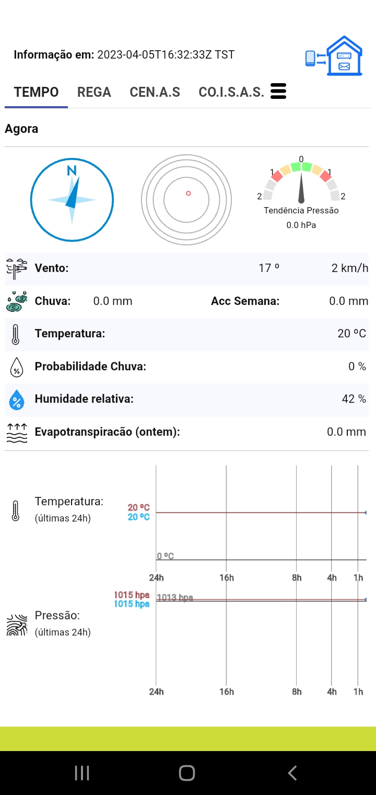
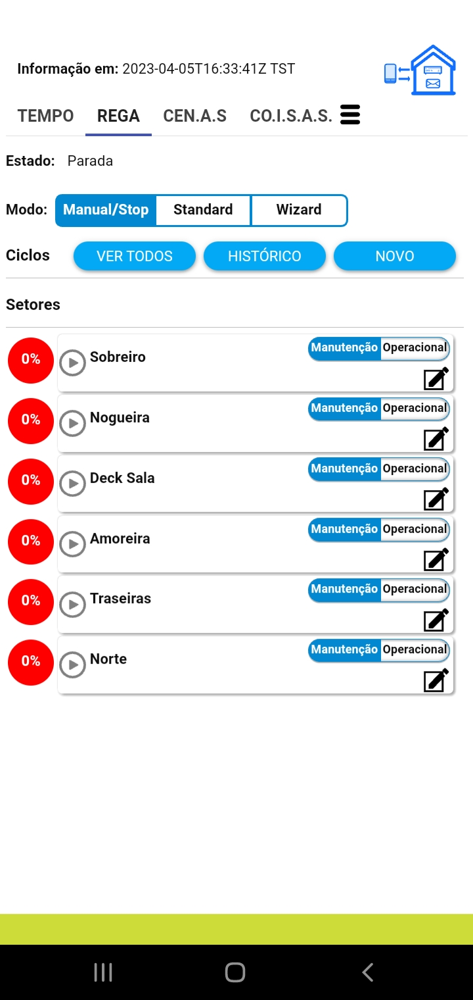
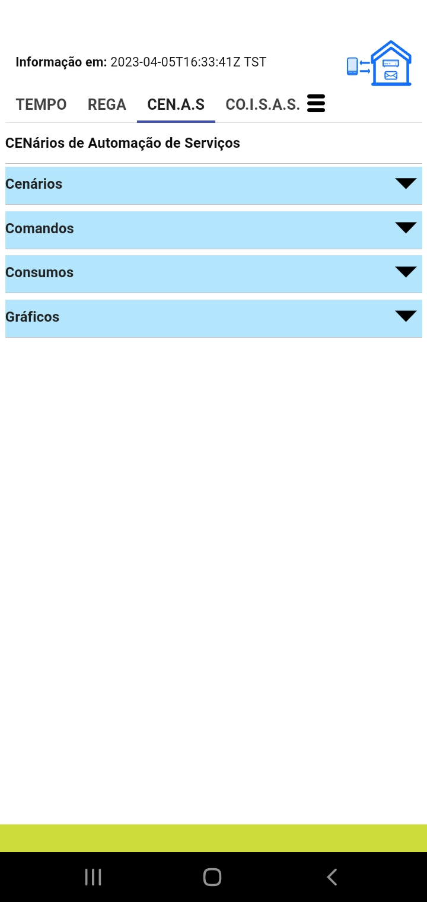
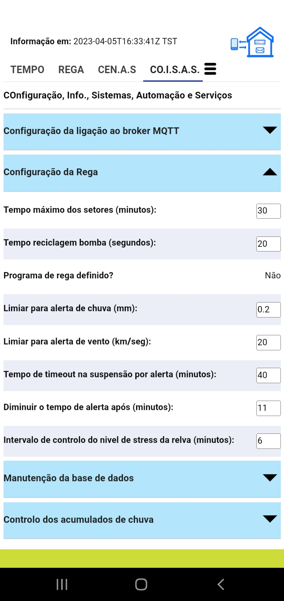

 

    <h3 align="center">Lagarto Controller</h3>
    

##Built With
[![RUST][rust]][rust-url] 
[![Javacript][javascript]][javascript-url] 
[![Mosquitto][mosquitto]][mosquitto-url] 
[![Apache][apache]][apache-url] 
[![Shelly][shelly]][shelly-url] 
[![Tempest][tempest]][tempest-url] 
[![SQLite][sqlite]][sqlite-url] 

  
Table of Contents

  <ol>
    <li><a href="#about-the-project">About The Project</a></li>
    <li><a href="#installation">Installation</a></li>
    <li><a href="#roadmap">Roadmap</a></li>
    <li><a href="#license">License</a></li>
    <li><a href="#contact">Contact</a></li>
    <li><a href="#acknowledgments">Acknowledgments</a></li>
  </ol>

## About The Project 

<strong>IoT backend controller + SPA Client + ML for next day rain probability.</strong>

 

<strong>Why:</strong> Just to keep my "nerd" spirit updated technology wise regarding HTML5, CSS3, SVG, RUST, Javascript ECMA2015, WebApps, Apache, SqLite, Linux, ...

First version was made with Python and MySql in the backend, but I simplified the database engine (sqlite uses less server resources than mysql) and with rust we use much less CPU, meaning lower power consuption (0%..0.5% versus 20%..40%)

Smart control for lawn watering, house central heater, integration and control of weather station data, and other sensors and actuators, with custom automation scenaries.

 

<strong> How it work:</strong> Async distributed system, with rust near real time controller, running on a intel NUC with linux/ubuntu.
 

The controller integrates and bridges the external devices:

* <i>Shellies</i> to control the lawn water valves, central heater, shutters, esternal gate, etc. 
* <i>Tempest</i> - weather station with readings each minute. Station transmit UDP packets, and we have a fail safe REST API channel to tempest site. 
* <i>Mosquitto MQTT Broker</i> near real-time clients integration (commands and status reading). 
* <i>Apache Web</i> for the SPA web application  
* <i>Green IT</i> - power consuption bellow 0.5% CPU. 
 
Also, as this is for limited and controlled usage, I've installed OpenSSL in a self-signed CA, and configured the Apache and the clients to work with two-way SSL authentication.
Client certificates are installed manually.  Not the best scenario, but as we are talking about 2 or 3 mobile phones, I decided to go this way.
Apache only serves https requests, and internally the requests are proxied to the backend.
Also defined some rules to allow for two environments (dev/test and production) as I use the same machine. All the devices have fixed IPs.

  
  
  
    

(<a href="#readme-top">back to top</a>)

## Installation

I will give more details, but the general instalation procedure is:
- install and configure apache (sample configuration to be provided) 
- install and configure mosquitto (sample configuration to be provided) 
- install SQLite and create databases in the desired location (scripts are provided) (https://sqlitestudio.pl/) 
- configure the the config files (see code example) 
- create site in apache and copy the ite files.  I've created an account in a free dynamic dns service 
- compile rust application for your plataform (rust have to be installed), or copy the exec to the desired location (linux64) 
- configure your devices in the database.  SQL must be used. I decided that making a UI for data entry, 
for something that is done once, on application installation and configuration and devices instalation, didn't deserve that effort.  
Any updates if/when necessary will be done also through SQL commands 

(<a href="#readme-top">back to top</a>)

<!-- ROADMAP -->
## Roadmap

As of 2023/Apr/5, weather data and lawn watering in the manual and standard modes are ready and in production for 4 months.

- [ ] Add Changelog
- [ ] Terminate testing of lawn watering wizard mode
- [ ] Terminate devices and scenarios control (client and backend)

See the [open issues](https://github.com/CarlosLagarto/controller_share/issues) for a list of known issues.

(<a href="#readme-top">back to top</a>)

## License

Distributed under the MIT License. See `license.txt` for more information.

(<a href="#readme-top">back to top</a>)

## Contact

Carlos Lagarto

Project Link: [https://github.com/CarlosLagarto/controller_share]
<!-- (https://github.com/your_username/repo_name) -->

(<a href="#readme-top">back to top</a>)

## Acknowledgments

Just a special thanks to the RUST community and Mozzila that have made this journey easier and fun!

(<a href="#readme-top">back to top</a>)

[rust]: https://img.shields.io/badge/Rust-1.68.2-yellowgreen?&style=for-the-badge
[rust-url]: https://www.rust-lang.org/
[javascript]: https://img.shields.io/badge/Javascript-ECMA2015-yellowgreen?&style=for-the-badge
[javascript-url]:https://developer.mozilla.org/pt-BR/docs/Web/JavaScript
[mosquitto]:https://img.shields.io/badge/mosquitto-MQTT%20Broker-yellowgreen?&style=for-the-badge
[mosquitto-url]:https://mosquitto.org/
[apache]: https://img.shields.io/badge/Apache-HTTP%20Server-yellowgreen?&style=for-the-badge
[apache-url]:https://httpd.apache.org/
[shelly]:https://img.shields.io/badge/Shelly-Home%20Automation-yellowgreen?&style=for-the-badge
[shelly-url]:https://www.shelly.cloud/en-pt
[tempest]:https://img.shields.io/badge/Tempest-Weather%20Station-yellowgreen?&style=for-the-badge
[tempest-url]: https://weatherflow.com/tempest-weather-system/
[sqlite]:https://img.shields.io/badge/SQLite-3.X-yellowgreen?&style=for-the-badge
[sqlite-url]: https://sqlite.org/index.html
